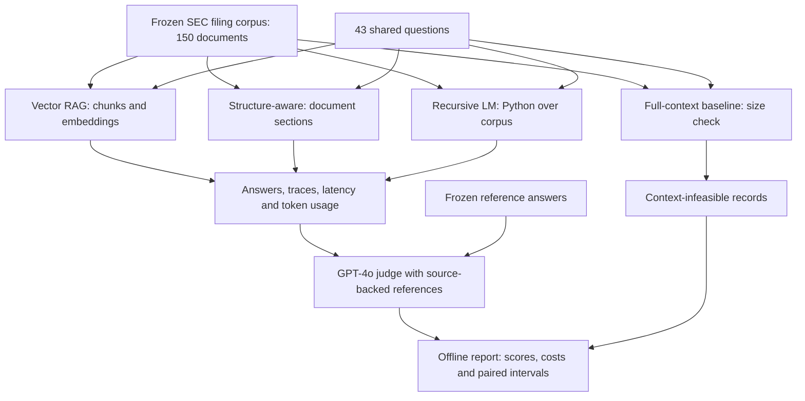

# Beyond Vector Search

**How do retrieval strategies trade answer quality against latency and cost when answering financial questions over SEC filings?**

Beyond Vector Search is a reproducible LLM evaluation project comparing vector retrieval, structure-aware retrieval, recursive language-model retrieval, and a full-context baseline. It includes pipeline implementations, a frozen filing corpus, source-backed reference answers, saved model outputs, and an offline report builder.

Financial QA makes retrieval errors visible: an answer can mention the right company yet use the wrong fiscal year, confuse revenue with net income, or compare companies without retrieving evidence for all of them. This project examines those failures alongside aggregate scores.

**Published v1:** 150 filings · 30 companies · 43 included questions · 4 configurations · 172 evaluation records · 23 tests.

This is an exploratory engineering study. Reference answers were checked by an AI agent against source filings; they have not been independently certified by human annotators.

[Quick start](#quick-start-no-model-api-calls) · [Architecture](#how-it-works) · [Results](#benchmark-results) · [Dataset](#dataset-and-source-verification) · [Limitations](#limitations) · [Portfolio walkthrough](docs/PORTFOLIO.md)

## What this project demonstrates

- **Retrieval engineering:** three implementations behind a common pipeline interface, plus an explicit context-limit baseline.
- **Evaluation design:** shared questions, corpus and generation model; a fixed judge; paired comparisons; retained failure and abstention records.
- **Data quality:** fiscal-year corrections, evidence excerpts, document hashes, and individually justified exclusions.
- **Operational measurement:** per-query latency, token-based generation costs, and separate indexing and judging estimates.
- **Reproducibility:** a compressed corpus snapshot, SHA-256 checksums, pinned direct dependencies, saved outputs and tests that run without API keys.

The deliverable is a runnable benchmark and an inspectable experiment. It does not require a hosted application to explore the findings.

## How it works



### The four configurations

| Configuration | Retrieval and answering | Release configuration |
|---|---|---|
| **Vector RAG** | Splits filings into overlapping chunks, embeds them, retrieves relevant chunks from Chroma, then generates an answer. | `text-embedding-3-small`; 1,024-token chunks; 128-token overlap; top 5 chunks. |
| **Structure-aware** (`pageindex`) | Builds section outlines, uses an LLM to select relevant sections, then answers from their text. | Up to 8 selected sections. This is local code, not an evaluation of the external PageIndex service. |
| **Recursive LM** (`rlm`) | Uses the `rlms` library to execute model-generated Python over the corpus, with recursive model calls available. | Depth 2; 5 root iterations; 300,000 cumulative-token budget; 180-second internal soft timeout. |
| **Full-context baseline** (`naive_llm`) | Checks whether the entire corpus fits the configured model context before attempting generation. | Returns `EXCEEDS_CONTEXT` for every v1 question; no generation API call is made. |

All answering pipelines use **GPT-4o mini**. Actual judge calls use **GPT-4o**. The headline metric is the mean judge score on a 0–1 rubric, **not exact-match accuracy**. The exact judge templates are included in [judge_config.json](data/release/v1/judge_config.json).

The benchmark runner records raw outputs and scored rows. The separate report builder checks question coverage and duplicate records, then recomputes summaries and paired intervals without contacting a model provider.

## Benchmark results

### Overall comparison

| Pipeline | Mean judge score (0–1) | Mean latency/query | Estimated generation cost/query |
|---|---:|---:|---:|
| Vector RAG | 0.495 | 1.45 s | $0.00072 |
| Structure-aware | 0.605 | 8.85 s | $0.01211 |
| Recursive LM | 0.344 | 14.03 s | $0.01559 |
| Full-context baseline | Infeasible on 43/43 | Not comparable | No model call |


Structure-aware retrieval scored higher overall, but used approximately **16.77× the generation cost** and **6.12× the query time** of vector RAG in this run. Its paired score difference versus vector retrieval was **+0.109**, with an exploratory 95% query-bootstrap interval of **[−0.067, +0.284]**. This sample does not establish a reliable overall winner.

Latencies exclude index construction and the one-second pacing delay between queries. The cost column excludes indexing and judging. The full-context baseline is infeasible, not “zero accuracy.” RLM produced eight explicit `NO_FINAL_ANSWER` results, which remain in the scoring denominator.

### Results by question type

| Question type | Questions | Vector RAG | Structure-aware | Recursive LM |
|---|---:|---:|---:|---:|
| Single-hop | 20 | 0.835 | 0.690 | 0.650 |
| Multi-hop | 17 | 0.224 | 0.571 | 0.094 |
| Aggregation | 3 | 0.067 | 0.333 | 0.067 |
| Pairwise | 3 | 0.200 | 0.500 | 0.000 |

Vector retrieval was strongest on direct extraction in this sample. Structure-aware retrieval performed better on multi-hop questions. The aggregation and pairwise tiers each contain only three questions, so their averages are especially uncertain.

### What the failures reveal

| Example | Observed behavior | Engineering implication |
|---|---|---|
| **q001: Apple FY2024 revenue** | All three answering pipelines returned $391,035 million or its equivalent. | Direct extraction provides a useful baseline before testing broader reasoning. |
| **q029: NVIDIA versus AMD growth** | Retrieved answers confused fiscal periods; RLM returned a dollar amount instead of the requested growth comparison. | Correct corpus metadata alone does not enforce temporal alignment during retrieval and answering. |
| **q041: five-company revenue ranking** | Vector and structure-aware answers omitted requested companies; RLM returned `NO_FINAL_ANSWER`. | Comparisons need evidence coverage for every requested entity. |

See [Findings](docs/FINDINGS.md) for failure analysis and [report.json](results/release_v1/report.json) for machine-readable results.

## Dataset and source verification

The frozen corpus contains **150 distinct SEC 10-K filings from 30 companies**, with five stored filing vintages per company. “Most recent” means the latest filing available for that company in this snapshot; it does not mean the latest filing available today.

The original question bank contained 75 questions. V1 retains **43 source-supported questions** and records **[32 exclusions with individual reasons](data/release/v1/exclusions.json)**. Exclusions include missing financial statements, ambiguous accounting definitions, invalid comparison premises, and descriptive questions without reviewed grading rubrics. V1 does not claim that all 75 original questions are validated.

For included answers, the [provenance records](data/ground_truth/provenance/) preserve source excerpts, document hashes, filing accessions and calculation notes. The first 20 answers also received a raw-HTML/XBRL check by the same agent. `verification_status: agent_verified` indicates those source checks; `verified: false` preserves the absence of independent human certification.

Ten NVIDIA/Walmart fiscal-year metadata labels were corrected using filing cover pages. Filing text and legacy document IDs were preserved. The [release manifest](data/release/v1/manifest.json) records the snapshot, and the included compressed corpus prevents reproduction from silently fetching different filings.

## Quick start: no model API calls

Validated with **Python 3.13.5 on macOS**. The package declares Python >=3.11; other Python/OS combinations have not been validated for this release. Commands below require Git, Make, gzip and `shasum` on your path. Installing dependencies requires network access; the subsequent preparation, tests and reporting use local artifacts.

```bash
git clone https://github.com/sraghav12/beyond-vector-search.git
cd beyond-vector-search

python3 -m venv .venv
source .venv/bin/activate
pip install -r requirements-release.txt

make prepare
make test
make report
```

| Command | What it does |
|---|---|
| `make prepare` | Extracts the approximately 19 MB frozen corpus archive and verifies five SHA-256 entries. |
| `make test` | Runs the 23 tests without model API calls, including release-integrity, reporting and cost-accounting checks. |
| `make report` | Regenerates `results/release_v1/report.json` and local review records from saved predictions and judge scores. It does not rerun generation or judging. |

For an optional editable package installation after installing dependencies:

```bash
pip install --no-deps -e .
```

Start by viewing the comparison chart above, then inspect `q001`, `q029` and `q041` in [raw outputs](results/release_v1/raw/) and [scored outputs](results/release_v1/metrics/). The [five-minute walkthrough](docs/PORTFOLIO.md) connects those examples to the design decisions.

## Run a new benchmark with model APIs

The release configuration requires OpenAI access to GPT-4o mini, GPT-4o and `text-embedding-3-small`. Use [.env.example](.env.example) as a template for a local `.env`, then set `OPENAI_API_KEY`. Keep real credentials out of version control.

To inspect the selected experiment without paid calls:

```bash
python scripts/run_benchmark.py \
  --pipeline all --scale 150 --model gpt-4o-mini \
  --queries data/release/v1/queries.json \
  --gold data/release/v1/gold_answers.json \
  --corpus-dir data/processed/release_v1 \
  --judge-model gpt-4o --dry-run
```

To generate and judge new answers after `make prepare`:

```bash
make benchmark OUTPUT=results/my_reproduction
python scripts/release_report.py --results results/my_reproduction
```

The Makefile supplies the release model choices and RLM budgets explicitly. New outputs go to the chosen directory; the default is `results/reproduction`, separate from published results.

**Fresh-run behavior:** the runner resumes existing result files, and pipelines cache answers. A new output directory alone does not guarantee new generations. Use a clean checkout without `.cache` for a fresh latency experiment. Do not append repeated experiments into the same output files.

**Execution limits:** RLM executes generated Python locally; use trusted data and an isolated environment. Its token/time budgets and the runner’s thread-based timeout do not forcibly cancel an in-flight provider request. The CLI option `--rlm-max-subcalls` maps to root iterations, not a strict sub-model-call count.

See [Setup](docs/SETUP.md) and [Methodology](docs/METHODOLOGY.md) for environment and execution details.

## Cost accounting

The historical v1 experiment cost approximately **$1.73**:

| Component | Estimated USD |
|---|---:|
| Answer generation | $1.22242 |
| One-time vector indexing | $0.32083 |
| Judging | $0.18424 |
| Small generation probe | $0.000003 |

A dated-model-name lookup defect initially recorded judge costs as zero. The lookup is fixed and regression-tested. Because original judge token usage was not persisted, its historical cost was reconstructed from stored prompts and responses. The original CSV fields are preserved; [spend_estimate.json](results/release_v1/spend_estimate.json) explains the corrected estimate.

This is an estimated historical cost, not a reconciled provider invoice, a runtime spending cap, or a guarantee of future prices.

## Repository guide

```text
beyond-vector-search/
├── pipelines/                  # Vector, section-based, recursive and naive pipelines
├── evaluation/                 # Runner, judge and supplementary metrics
├── data/
│   ├── release/v1/             # Frozen corpus, questions, answers, exclusions, hashes
│   └── ground_truth/provenance/# Source excerpts and annotation audit history
├── results/release_v1/
│   ├── raw/                    # Original pipeline answers and traces
│   ├── metrics/                # Per-answer scores and judge reasoning
│   ├── report.json             # Summary statistics and paired intervals
│   └── spend_estimate.json     # Historical cost reconstruction
├── scripts/
│   ├── run_benchmark.py        # Run generation and evaluation
│   └── release_report.py       # Rebuild the report without API calls
├── tests/                      # Pipeline, evaluation and release checks
├── docs/                       # Methodology, findings, setup and portfolio guide
├── Makefile                    # Reproduction entry points
└── requirements-release.txt    # Pinned direct runtime and test dependencies
```

Use the release files explicitly when reproducing v1. The original question bank and historical audit documents describe earlier states and may include questions excluded from the published experiment.

## Limitations

- **Annotation and judge independence:** source checks were performed by an AI agent, and GPT-4o judged GPT-4o-mini outputs. Independent human calibration and judge-agreement measurements remain future work.
- **Small, curated sample:** one generation model, one run, one corpus size and 43 questions. The retained subset was selected after earlier exploratory work, not as a preregistered held-out test.
- **Dependent observations:** questions share companies and source documents. The 10,000-resample paired query bootstrap does not account for that dependence.
- **Implementation-specific findings:** the local section selector and capped, extraction-oriented RLM prompt do not represent the best possible versions of those method families.
- **No scaling conclusion:** earlier experiments confounded corpus size with evidence availability. V1 reports only the 150-document corpus.
- **Reproduction versus identical output:** model aliases and generation behavior can change. Saved artifacts reproduce the reported analysis; fresh API calls need not produce identical answers.

Follow-up research would prioritize independent human calibration, repeated runs, temporal retrieval, evidence coverage across companies, and an evidence-complete scaling study.

## Further reading

| Document | Purpose |
|---|---|
| [Findings](docs/FINDINGS.md) | Results, failures, cost reconstruction and interpretation. |
| [Methodology](docs/METHODOLOGY.md) | Dataset scope, exact parameters, scoring and uncertainty. |
| [Setup](docs/SETUP.md) | Offline reproduction and paid-run instructions. |
| [Portfolio walkthrough](docs/PORTFOLIO.md) | Resume wording and a five-minute technical explanation. |
| [Human review checklist](docs/HUMAN_REVIEW.md) | Review material for the first 20 reference answers; not a completed independent validation. |
| [Release manifest](data/release/v1/manifest.json) | Frozen files, filing identities and provenance. |
