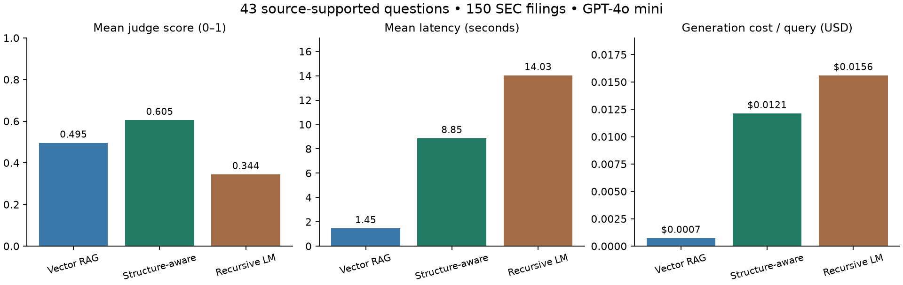

# Beyond Vector Search

A reproducible comparison of retrieval strategies for financial question answering over SEC 10-K filings.

**Release v1 is complete locally:** 43 source-supported questions, 150 distinct filings from 30 companies, four pipeline configurations, and 172 fresh evaluation records. The study is exploratory; reference answers were checked by an AI agent against source filings, not independently certified by human annotators.

## Main finding

Structure-aware retrieval scored higher overall, while vector retrieval was substantially cheaper and stronger on single-hop questions. The sample does **not** establish a statistically reliable overall winner.

| Pipeline | Mean judge score (0–1) | Mean latency | Generation cost/query |
|---|---:|---:|---:|
| Vector RAG | 0.495 | 1.45 s | $0.00072 |
| Structure-aware (`pageindex`) | 0.605 | 8.85 s | $0.01211 |
| Recursive LM (`rlm`) | 0.344 | 14.03 s | $0.01559 |
| Full-corpus prompt | Infeasible | — | No model call |

Costs are estimates from token usage and list prices; indexing and judging are separate. The naive baseline exceeds the configured context window and is **not** reported as zero accuracy. RLM returned eight explicit abstentions; all attempted questions remain in the scoring denominator.



On the 20 single-hop questions, vector RAG scored **0.835**, versus **0.690** for structure-aware retrieval and **0.650** for RLM. Structure-aware retrieval performed better on the 17 multi-hop questions. There are only three questions each in the aggregation and pairwise tiers, so those means are especially uncertain.

The paired structure-aware-minus-vector mean difference is **+0.109**, with an exploratory query-bootstrap 95% interval of **[−0.067, +0.284]**. Shared companies make questions dependent; this interval is descriptive, not a general population guarantee.

## What is implemented

- **Vector RAG:** 1,024-token chunks, 128-token overlap, `text-embedding-3-small`, Chroma, top-5 retrieval, answer generation.
- **Structure-aware retrieval:** a local implementation that identifies document sections, selects sections through an LLM, and generates an answer. This is not a benchmark of an external PageIndex service.
- **Recursive LM:** the `rlms` library runs model-generated Python over the corpus and supports recursive sub-model calls. This release caps root iterations at five, cumulative tokens at 300,000, and internal time at 180 seconds. The extraction-oriented prompt is a limitation on complex questions.
- **Naive baseline:** attempts to fit the entire corpus in the configured model window; returns a structured infeasibility result before making a paid call.

Generation uses `gpt-4o-mini`; actual judge calls use `gpt-4o`. One model family, one corpus, and one frozen question set are used for the comparison.

## Dataset integrity

The original bank contained 75 questions. V1 retains **43** with concrete source-backed answers and records [32 exclusions with reasons](data/release/v1/exclusions.json). Missing financial statements, ambiguous accounting definitions, invalid premises, and open-ended questions without grading rubrics were excluded. The original question bank and prior results remain available for audit.

Ten NVIDIA/Walmart fiscal-year metadata labels were corrected from the filing cover pages. Legacy document IDs were kept stable. Each included answer links to evidence excerpts, document hashes, filing accessions, and calculation notes. The compressed frozen corpus is included, so reproduction does not silently fetch a newer filing.

Earlier scaling experiments mixed corpus size with whether evidence was available. V1 reports **only the 150-document corpus**; it makes no scaling claim. Selection happened after earlier exploratory work, so this is not a preregistered held-out evaluation.

## Reproduce

Tested with Python 3.13.5 on macOS. The analysis and tests do not require API keys.

```bash
python3 -m venv .venv
source .venv/bin/activate
pip install -r requirements-release.txt
make prepare
make test
make report
```

`make prepare` restores the frozen corpus and verifies SHA-256 hashes. `make report` regenerates the numerical report from included predictions and scores without API calls.

For a new paid run, set `OPENAI_API_KEY` in a local `.env` file using `.env.example` as a guide, then:

```bash
make benchmark OUTPUT=results/my_reproduction
python scripts/release_report.py --results results/my_reproduction
```

The runner resumes existing output and pipelines cache answers. Use a clean checkout/environment with no `.cache` directory for a fresh latency experiment. The original release spent approximately **$1.73**, including estimated indexing/judging; this is not a spending limit or a promise of future prices. RLM can execute generated Python locally; run only trusted corpora in an isolated environment.

## Evidence and walkthrough

- [Findings and limitations](docs/FINDINGS.md)
- [Experimental methodology](docs/METHODOLOGY.md)
- [Setup and run commands](docs/SETUP.md)
- [Five-minute interview walkthrough and resume bullet](docs/PORTFOLIO.md)
- [Frozen dataset manifest](data/release/v1/manifest.json)
- [Results and paired uncertainty](results/release_v1/report.json)
- [Spend estimate and accounting caveat](results/release_v1/spend_estimate.json)
- [Human review checklist for the first 20 answers](docs/HUMAN_REVIEW.md)

A higher-cost strategy need not win to make the experiment useful. The project demonstrates retrieval engineering, source verification, experiment repair, and explicit cost/quality tradeoffs.
